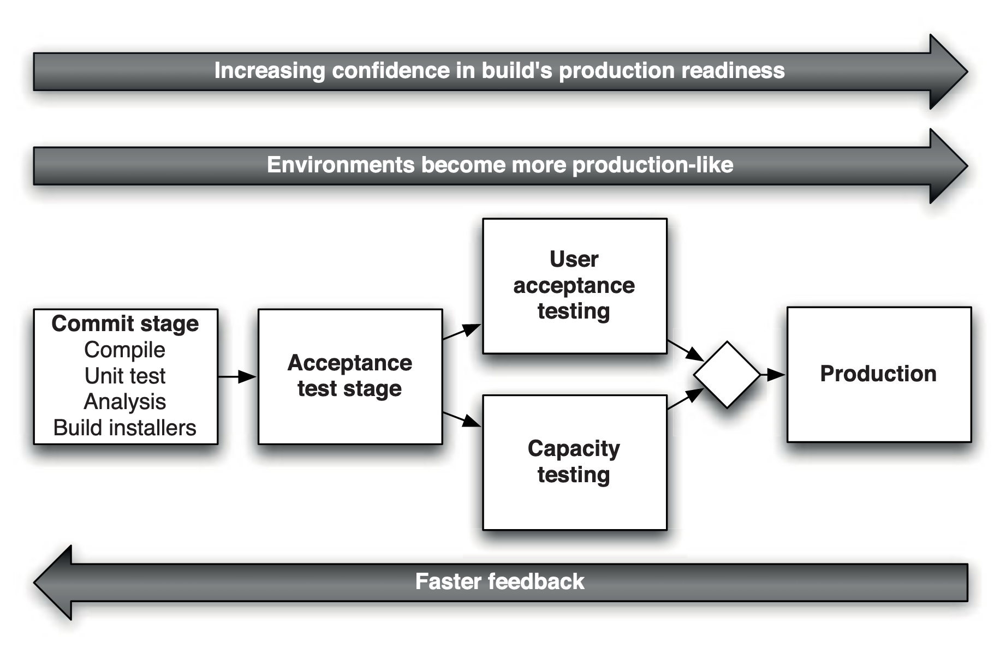

# Automated acceptance testing
> The key words MUST, MUST NOT, REQUIRED, SHALL, SHALL NOT, SHOULD, SHOULD NOT, RECOMMENDED, MAY, and OPTIONAL in this document are to be interpreted as described in [RFC 2119][1].

## Introduction
An application deployed in any environment requires extensive functional testing before propagation into the next stage. Functional testing is conducted to evaluate the compliance of a system or component with specified functional requirements, it is not concerned with application internals.

Once your software has passed a set of unit and integration tests in the commit stage, a release candidate is built and deployed to an artifact store. This is usually the trigger for the deployment pipeline to run and deploy the artifact into an environment where it will have to pass a second stage of tests, the acceptance test stage:

As the artifact moves from the left to the right towards production it is deployed into more environments which increasingly resemble the final production environment. The feedback cycles are getting longer while at the same time the confidence in the build's production readiness increases. Acceptance tests will assess whether an artifact meets functional requirements and is acceptable for deployment to production. Definition of acceptance testing by [ISTQB][2]:

> Acceptance testing: Formal testing with respect to user needs, requirements, and business processes conducted to determine whether or not a system satisfies the acceptance criteria and to enable the user, customers or other authorized entity to determine whether or not to accept the system.

Automated acceptance tests contextually belong in the upper-left quadrant of the famous agile testing quadrants, originally proposed by [Brian Marick][3]:

## Acceptance criteria
Acceptance tests are created from acceptance criteria. These criteria MUST be defined before development on a story starts and acceptance tests MUST be derived from these criteria as early as possible. It is invaluable to involve everyone on the team as much as possible in the process of designing acceptance criteria. Only if everyone is on the same level, so to speak, are you able to benefit from shared knowledge and minimize trouble down the line. It is a great way to create a common understanding of the value of the new feature and to nip potential misunderstandings in the bud. One SHOULD NOT make assumptions based only on one's own perception. Communication (as in every aspect of life) is key!

## Ownership
Acceptance tests SHOULD be owned by everyone because they provide value for everyone, they are a collaborative effort. They SHOULD be familiar to each person in an agile development team and everyone SHOULD know their scope. Everyone shares responsibility for these tests and fixing them SHOULD always get the appropriate priority.

## Propagation through the pipeline
An artifact SHOULD not be deployed to production without first having passed the entire acceptance test stage by being deployed to the first environment and propagating through all available stages towards production. It SHOULD be easier to fix the tests and pass the acceptance test stage than to circumvent the stage entirely.

## Atomicity
Acceptance tests MUST be atomic in that they are self-contained (meaning they provide their own configuration and do their own setup when run in isolation) and MUST be able run independently from each other. They MUST be free from side-effects and idempotent, i.e. running the same test multiple times MUST not change the outcome when compared to the first run. There MUST not be a pre-determined order to run the tests in, use setup methods for creating conditions for the tests to run under. In addition to that, they SHOULD be able to run in parallel without creating or failing because of race conditions. This means that ideally each test uses unique test data over the dimensions time and space, i.e. ephemeral test data that is dynamically created and destroyed after the test suite has finished.

## Information and value
The duration of the acceptance test suite SHOULD be kept reasonably short to provide fast feedback about the system under test. Use of parallelization whenever possible is strongly advised. One requirement for maximum parallelization is atomicity of tests, of course. Acceptance tests SHOULD provide fast and reliable feedback whenever an error occurs and SHOULD also provide the necessary information to identify the source of the error as a quickly as possible. Flaky tests (Toggling, flipping or otherwise unreliable tests) provide no value to an agile development team. Even worse, they decrease confidence in the acceptance test suite and MUST be eliminated promptly. Use retry mechanics in your tests if possible! If a test is still flaky, throw it into the trash. Acceptance tests SHOULD always be kept green. Run them at least nightly and fix any failures immediately.

[1]: https://tools.ietf.org/html/rfc2119
[2]: https://www.istqb.org/
[3]: http://www.exampler.com/old-blog/2003/08/21.1.html#agile-testing-project-1