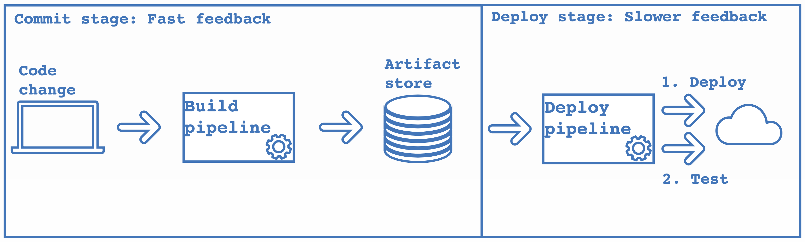

# Automated acceptance testing
> The key words MUST, MUST NOT, REQUIRED, SHALL, SHALL NOT, SHOULD, SHOULD NOT, RECOMMENDED, MAY, and OPTIONAL in this document are to be interpreted as described in [RFC 2119][1].

## Introduction
An application deployed in any environment requires extensive functional testing before propagation into the next stage. Functional testing is conducted to evaluate the compliance of a system or component with specified functional requirements, it is not concerned with application internals.

 Acceptance tests will assess whether an artifact meets functional requirements and is acceptable for deployment to production. They are run after unit and integration tests against the deployed application. Definition of acceptance testing by [ISTQB][2]:

> Acceptance testing: Formal testing with respect to user needs, requirements, and business processes conducted to determine whether or not a system satisfies the acceptance criteria and to enable the user, customers or other authorized entity to determine whether or not to accept the system.

Automated acceptance tests contextually belong in the upper-left quadrant of the famous agile testing quadrants, originally proposed by [Brian Marick][3]:

While unit and integration tests are more concerned with the functionality of units of code in isolation and in concert with other units, acceptance tests take a high-level, outsider's view of the application and its features. In further contrast to more internal kinds of tests, functional acceptance tests are explicitly concerned with the value the application brings to its customers and are thus business-facing.

## Value

Functional acceptance tests verify that the application delivers the expected value for the “customer, they specify expected application behavior and their success indicates that the acceptance criteria of a story have been fulfilled. Tests of such nature also guard against regressions introduced by changes and make sure new changes don’t break existing functionality. Fully automated delivery pipelines including tests clear the way to continuous deployment. Since they generally use high-level and domain-specific language acceptance tests are an executable application specification. They are a source of truth for required application behavior and are invaluable to an agile development team.

## Architecture of the logical development pipeline

### Commit stage

Beholding the logical development pipeline from local code change to the eventual deployment to production, we can separate the process into two stages. The first stage is the so-called commit stage. A commit that is pushed from a developer's machine to the version control system triggers a technical pipeline on the CI system. This pipeline usually involves a first general validity check of the project, compiling the sources, running unit and integration tests and creating a deployable assembly. Every deployable built by this pipeline is a possible release candidate and its internal validity has been established by the tools invoked in the build process. Uploading the release candidate to an artifact store marks the end of the commit stage:

### Deploy stage

A new version of the deployable will, on its way to production, have to pass through the second stage of our logical development pipeline, the deploy stage. In this stage, another technical pipeline deploys the artifact into a production-like environment for the first time. There, it will have to pass a second set of tests which we call acceptance tests. Further, in this stage we can run security tests, performance tests and also manual tests. Each individual test stage in the deploy stage will filter out possibly bad release candidates. The test suites give us confidence in the production-readiness of our software, and if the artifact makes it successfully through all the test stages and thus the deploy stage it may be deployed to production.

The tradeoff between the commit stage and the deploy stage is that as the artifact moves from the left to the right towards production the feedback cycles are getting longer while at the same time the confidence in the build's production readiness increases:

## Acceptance criteria
Acceptance tests are created from acceptance criteria. These criteria MUST be defined before development on a story starts and acceptance tests MUST be derived from these criteria as early as possible. It is invaluable to involve everyone on the team as much as possible in the process of designing acceptance criteria. Only if everyone is on the same level, so to speak, are you able to benefit from shared knowledge and minimize trouble down the line. It is a great way to create a common understanding of the value of the new feature and to nip potential misunderstandings in the bud. One SHOULD NOT make assumptions based only on one's own perception. Communication (as in every aspect of life) is key!

## Ownership
Acceptance tests SHOULD be owned by everyone because they provide value for everyone, they are a collaborative effort. They SHOULD be familiar to each person in an agile development team and everyone SHOULD know their scope. Everyone shares responsibility for these tests and fixing them SHOULD always get the appropriate priority.

## Propagation through the pipeline
An artifact SHOULD not be deployed to production without first having passed the entire acceptance test stage by being deployed to the first environment and propagating through all available stages towards production. It SHOULD be easier to fix the tests and pass the acceptance test stage than to circumvent the stage entirely.

## Atomicity
Acceptance tests MUST be atomic in that they are self-contained (meaning they provide their own configuration and do their own setup when run in isolation) and MUST be able run independently from each other. They MUST be free from side-effects and idempotent, i.e. running the same test multiple times MUST not change the outcome when compared to the first run. There MUST not be a predetermined order to run the tests in, use setup methods for creating conditions for the tests to run under. In addition to that, they SHOULD be able to run in parallel without creating or failing because of race conditions. This means that ideally each test uses unique test data over the dimensions time and space, i.e. ephemeral test data that is dynamically created and destroyed after the test suite has finished.

## Information content
The duration of the acceptance test suite SHOULD be kept reasonably short to provide fast feedback about the system under test. Use of parallelization whenever possible is strongly advised. One requirement for maximum parallelization is atomicity of tests, of course. Acceptance tests SHOULD provide fast and reliable feedback whenever an error occurs and SHOULD also provide the necessary information to identify the source of the error as a quickly as possible. Flaky tests (Toggling, flipping or otherwise unreliable tests) provide no value to an agile development team. Worse even, they decrease confidence in the acceptance test suite and MUST be eliminated promptly. A solid test setup and retry mechanics are good ways to make a test suite more robust. If a single test continues to be flaky, throw it into the trash. Acceptance tests SHOULD always be kept green. Run them at least nightly and fix any failures immediately. Remember: A solid acceptance test suite gives confidence in your software and carries inherent value.

[1]: https://tools.ietf.org/html/rfc2119
[2]: https://www.istqb.org/
[3]: http://www.exampler.com/old-blog/2003/08/21.1.html#agile-testing-project-1